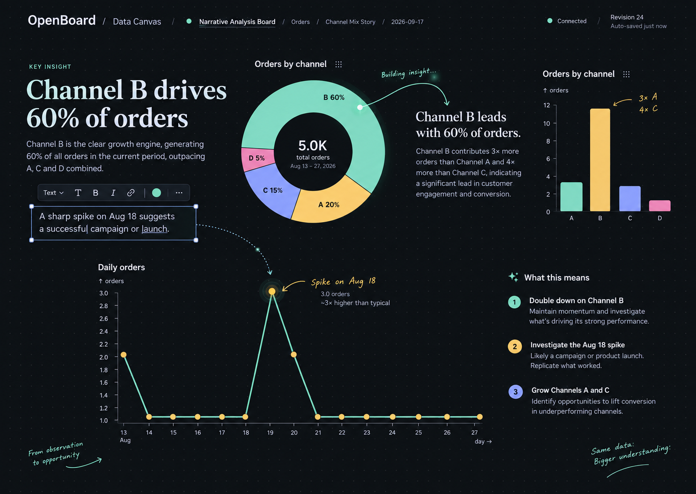

# OpenBoard

OpenBoard 是一个给 AI agent 用的本地数据可视化运行时。它让 agent 把分析过程落在一张持续存在的 Canvas 上：发现本地 CSV 或 Parquet，查看字段和数据分布，创建图表，再根据新的问题直接修改同一张图。

它解决的不是“让 agent 生成一个一次性的 HTML 报表”，而是让数据分析可以留下来、继续改、分支比较，也可以回到上一个版本。数据是颜料，Canvas 是画布，agent 负责把推理变成看得见的东西。



## 它怎么工作

```text
本地 CSV / Parquet
        ↓
DuckDB 查询与数据观察
        ↓
MCP 工具创建或修改 Scene
        ↓
WebSocket 推送到浏览器 Canvas
        ↓
Observable Plot / 安全 SVG 图元渲染
```

`Scene` 是唯一持久状态：数据集、图表、标注、布局和历史都在这里。浏览器 DOM、SVG 和渲染产物只是可随时重新生成的结果。

例如，agent 可以完成这样的连续操作：

> “按渠道看失败率” → “只保留华东” → “把当前图改成近 30 天趋势” → “复制一份，按产品拆开比较” → “回到拆分前”

每一步都修改或扩展同一张分析画布，不需要重新生成页面，也不会刷新浏览器。

## 核心能力

- 从本地目录发现 CSV 与 Parquet，不需要导入向导。
- 通过 DuckDB 执行安全的 `QuerySpec` 或受限只读 SQL。
- 用 10 个 MCP 工具管理数据、图表、布局、标注、历史和显式工作会话。
- 使用组合式视觉语法：统计图层和 `arc`、`line`、`area`、`text` 等 SVG 图元可以叠在同一张图上。
- 通过 WebSocket 让浏览器立即看到真实查询和渲染带来的更新。
- 保存操作历史，支持 patch、clone、undo、redo、goto 与 fork。
- 超出渲染限制时明确返回 `render_limit_exceeded`，不会悄悄抽样。

OpenBoard 不做仪表盘搭建器、模板市场、字段后台、云同步或聊天式数据分析界面。它是一套让 agent 直接操作持久分析场景的运行时。

## 快速开始

需要 Node.js 22 或更新版本。

```bash
npm ci
npm run verify:core
npm start
```

默认会以 stdio MCP transport 启动。浏览器端和本地数据目录可通过环境变量配置；示例数据在 [`examples/`](examples/) 中，包含订单 CSV、场景种子和一次交互轨迹。

最小验证会检查契约、TypeScript 构建、Scene/history、DuckDB、MCP、持久化、WebSocket 与 M0/M1 工作流：

```bash
npm run verify:core
```

## 用 MCP 操作 Canvas

分析型操作遵循一条明确的工作链：

```text
work.apply(begin)
  → data.inspect / data.query
  → visual.create / visual.patch / visual.clone
  → work.apply(commit)
```

当用户要求改变当前图时，优先使用 `visual.patch` 原地修改。只有需要保留旧图做对照或分支时，才使用 `visual.clone`。完整工具输入与输出契约见 [`contracts/tool-surface.json`](contracts/tool-surface.json)，Scene 格式见 [`contracts/scene.schema.json`](contracts/scene.schema.json)。

## 项目结构

- [`src/core/`](src/core/)：Scene、历史、QuerySpec 与数据观察等领域逻辑。
- [`src/data/`](src/data/)：本地数据发现、元数据缓存与 DuckDB 适配器。
- [`src/runtime/`](src/runtime/)：工作会话、持久化、事件与查询产物。
- [`src/mcp/`](src/mcp/)：MCP 协议适配层。
- [`src/web/`](src/web/) 和 [`web/`](web/)：HTTP/WebSocket 服务和浏览器 Canvas。
- [`contracts/`](contracts/)：冻结的 MCP、Scene 与事件契约。
- [`examples/`](examples/)：可公开使用的示例数据与场景。
- [`docs/`](docs/)：产品规格、实现计划、远程 MCP 配置与验收记录。

## 远程部署

OpenBoard 可以用一个 Node 进程同时提供浏览器 Canvas、WebSocket 和 Streamable HTTP MCP。部署时将 `OPENBOARD_MCP_TRANSPORT` 设为 `http`，并把真实的 `OPENBOARD_MCP_TOKEN` 放在 Git 忽略的环境文件中。

完整配置、Caddy 示例和客户端连接方式见 [远程 MCP 文档](docs/remote-mcp.md)。`.datacanvas/` 是运行时 Scene 与本地数据路径的持久化目录，不能提交或同步到其他环境。

## 设计与贡献

产品定义见 [Data Canvas V1 设计](docs/superpowers/specs/2026-09-09-data-canvas-v1-design.md)。开始修改前，请先阅读 [`AGENTS.md`](AGENTS.md)：它定义了 Scene、WorkSession、渲染限制和实时构建的架构边界。

## 许可证

[MIT](LICENSE)
